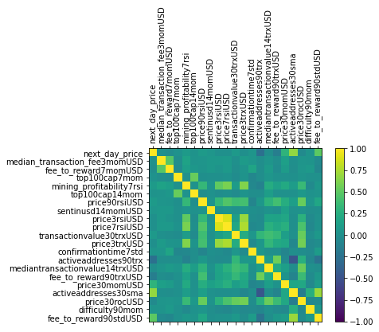

[](https://github.com/dagartga/production_repo/actions/workflows/main.yml)

## Introduction

This is the repo for my capstone project for the [Machine Learning Engineer course at Springboard](https://www.springboard.com/courses/ai-machine-learning-career-track). This project originally used data downloaded from the paid Tier 2 of [glassnode.com]( https://glassnode.com). But for the final model the data used was scraped from [bitinfocharts.com](https://bitinfocharts.com/), which is freely available. 

Initial research into journal articles that have done ML on Bitcoin price prediction produced two interesting articles. The first article is [A Self-Adaptive Deep Learning-Based Algorithm for Predictive Analysis of Bitcoin Price]( https://ieeexplore.ieee.org/document/9359745). The second article is [Time-series forecasting of Bitcoin prices using high-dimensional features: a machine learning approach](https://link.springer.com/article/10.1007/s00521-020-05129-6)

The final model is an ANN model with 4 hidden layers trained and validated with data from April 1, 2013 to October 10, 2021 and a R-squared of 0.9711 for predicting the next day closing price of Bitcoin.

## Problem Statement

Bitcoin is a very volatile asset and being able to predict whether it will have a big change in price the next day allow investors to prepare properly. Unlike most investment vehicles, Bitcoin has a completely open ledger system which allows all transactions and mining activity to be monitored. By looking at the type of transactions and the number of transactions, as well as the amount of mining power, it can be possible to predict changes in the price.

## Data Format

The raw dataset used for the ANN models, including the final ANN model, as well as the support vector machine modeling, is [“Merged_Unconverted_BTC_Data.csv”]( https://github.com/dagartga/production_repo/blob/main/Merged_Unconverted_BTC_Data.csv). The data was scraped from [bitinfocharts.com](https://bitinfocharts.com/) and includes data transformations such as different Moving Averages, Relative Strength Index, Momentum, etc. The dataset has 4103 rows and 736 columns.

The data used for polynomial regression came from [glassnode.com]( https://glassnode.com) and is in [‘glassnode_data’]( https://github.com/dagartga/production_repo/tree/main/glassnode_data) and was used for training and testing polynomial regression and the support vector machine.
Other than the date, all data is either continuous or discrete variables. There was no categorical data used. The target (price) is valued in US dollars.

## Simple prediction benchmark
My benchmark for prediction was to take the current daily price of bitcoin and use that as the prediction for tomorrow’s price.  

**Example:** The price on October 9, 2021 was 54742. Therefor the benchmark prediction for October 10 price is 54742, which will be compared against the actual October 10 price of 55138.

**The benchmark results were:**
	R – squared: 0.869
	MAPE: 2.194

## Explorative Data Analysis

Initial exploration of the data revealed there were no missing data and no bizarre data points.

For feature selection, **Random Forest Regression Feature Importance**, **Variance Inflation Factor**, and **Correlation Matrix** were used to narrow the features.
**Random Forest Regression Feature Importance** was used to take the highest scoring 100 features from the analysis.
From those 100 features, **Variance Inflation Factor** analysis was used to take the 20 features with the lowest VIF scores.

From those 20 features, they were analyzed in a **Correlation Matrix** to narrow down to only features that were not cross correlated. From the Correlation Matrix analysis, price3trxUSD and price7rsiUSD were removed because they had over 0.75 correlation with at least one other feature.




# Testing different model types

## Polynomial Regression prototype

From notebook [Bitcoin_Polynomial_Regression](notebooks/Bitcoin_Polynomial_Regression.ipynb)

The simplest model to try first seemed to be a linear regression model. By using a polynomial regression model, the many different features and their influence can be captured. The first polynomial regression model tested for 1-day price prediction was using 15 features from glassnode.com and a date range of 01-01-2013 to 06-10-2021.

Determining the best number of polynomial degrees was the first step and based on comparison of initial models with degrees from 1 to 4, the best performing was degree 2, with a test R-squared of 0.988 and test RMSE of 1236 and train R-squared of 0.989 and RMSE of 1054. This showed that the model was not overfitting. The model performed poorly on the **30-day holdout validation data** with the following statistics:
	
	R-squared: -5.39
	RMSE: 10950

Besides 1-day price prediction, other prediction date ranges were tried. These include, 2-day, log 1-day, 1-day change, 3-day, 7-day, 180-day. The best performance was from the 1-day price, which indicates that the data is more relevant for the next day than any other future day’s price. 

Next was tuning the date range of data. The model was tested using data from date ranges of four, five, six, and seven years. Changing the date range of data did not improve the prediction scores. The best new date range tested was six years (01-01-2015 to 06-10-2021) with the following statistics:

	R-squared: -6.34
	RMSE: 11739

From notebook [Bitcoin_Polynomial_Regression_Feature_Matrix](notebooks/Bitcoin_Polynomial_Regression_Feature_Matrix.ipynb)

A significant adjustment was made to the way predictions were calculated using the polynomial regression. By calculating the percent difference between the previous day’s prediction and today’s prediction, the model’s predicted change in price is extracted. By multiplying (1 + the percent change) to the current price, it creates a prediction based on the direction and magnitude of the polynomial prediction but brings it to a starting point which is today’s actual price. 

**Example:** 

Current Price = 49916

Previous 1-day Predicted Price = 61452

1-day Predicted Price = 59520

Change in predicted prices = -1932 / 61452 = -0.0314
 
New 1-day Predicted Price = 49916 * (1 - 0.0314) = 48348
 
 **The best performance using polynomial regression and the current price adjustment:**
 	
	R-Squared: 0.663
	RMSE: 2546.6
	
Feature Selection was tried with forward addition of features starting from the best performing set of features and only keeping features that improved the model. It did not yield better results and the original 15 features were still the best. As well, this forward addition was tried with a smaller starting set of features and using feature importance to determine the order of features added. This did not improve importance either.

**Conclusion: Polynomial Regression is not a promising model for this problem.**
 	

## Tensorflow Artificial Neural Network model

From the notebook [Bitcoin Next Day Price Prediction Using ANN Models](notebooks/Bitcoin%20Next%20Day%20Price%20Prediction%20Using%20ANN%20Models.ipynb)

The ANN TensorFlow model was the best performing model after multiple rounds of parameter and hyperparameter 
optimization, as well as feature selection based on model performance.  The final performance for the best ANN model is an R-squared of 0.9711 and a Mean Average Percentage Error of 1.0354.
6 Artificial Neural Network Models were created. Each model had a different date range interval. The first three date ranges are from this [journal article](https://link.springer.com/article/10.1007/s00521-020-05129-6) while the last three use date ranges with more current ending dates.

    ANN Model 1 used data from April 1, 2013 to July 19, 2016 (Interval 1) -from journal article
    ANN Model 2 used data from April 1, 2013 to April 1, 2017 (Interval 2) -from journal article
    ANN Model 3 used data from April 1, 2013 to December 31, 2019 (Interval 3) -from journal article
    ANN Model 4 used data from April 1, 2013 to September 1, 2021 (Interval 4)
    ANN Model 5 used data from April 1, 2015 to September 1, 2021 (Interval 5)
    ANN Model 6 used data from April 1, 2014 to September 1, 2021 (Interval 6)
    
Each of these models was given the same set of 10 features, which were determined from the journal article, and target (next_day_price), just different date ranges which is a parameter that may make a difference in the performance of the model.

Each model had 4 hidden layers, used batch size 64, and had early stopping after 100 epochs of no improvement of validation loss.

Then each model looped through a grid search of hyperparameters for tuning:
    
    Optimizers ['Adam', 'RMSprop']
    Neurons [200, 300, 400, 500, 600]
    Activation ['relu', 'elu']
    Learning Rate [0.01, 0.001, 0.0001]
    
The statistics for each run of the model were the R-squared, Mean Absolute Error, and Mean Absolute Percentage Error. The holdout R-squared was the main statistic for choosing a model, since it shows how close the residuals are to the regression line. Secondarily, the holdout MAPE was used to view how much percentage error there is from the predictions. 

The **holdout dataset** consisted of the final 30 days of data, which is also the most current data from the set.

#### Results from the ANN Models using hyperparameter tuning and different date ranges
The best holdout statistics for each date range interval are below.

**Interval 1:** 

    R-squared: 0.646
    MAPE: 3.876
    Model hyperparameters: Neurons = 400, Optimizer = Adam, Activation = relu, Learning Rate = 0.001
    
**Interval 2:**

    R-squared: 0.714
    MAPE: 3.370
    Model hyperparameters: Neurons = 300, Optimizer = Adam, Activation = relu, Learning Rate = 0.001
    
**Interval 3:**

    R-squared: 0.712
    MAPE: 3.372
    Model hyperparameters: Neurons = 600, Optimizer = Adam, Activation = relu, Learning Rate = 0.01
    
**Interval 4:**
    
    R-squared: 0.829
    MAPE: 2.564
    Model hyperparameters: Neurons = 300, Optimizer = Adam, Activation = relu, Learning Rate = 0.001
    
**Interval 5:**

    R-squared: 0.801
    MAPE: 2.703
    Model hyperparameters: Neurons = 200, Optimizer = Adam, Activation = relu, Learning Rate = 0.001
    
**Interval 6:**

    R-squared: 0.792
    MAPE: 2.866
    Model hyperparameters: Neurons = 600, Optimizer = Adam, Activation = relu, Learning Rate = 0.001
    

### ANN Model using the Features from Feature Importance, VIF, and Correlation Matrix

Taking the top 20 features from the VIF analysis to iterate through in combination to compare the effect it has on the ANN model performance. Starting with the top 6 features and training an ANN model. Then adding the one more feature to the list of features and training the ANN model. After which, the holdout R-squared scores are compared and if the holdout R-squared score is better, then keep that feature in the list otherwise drop that feature.

The ANN model consisted of hyperparameters that scored well in previous analysis: 

**4 hidden layers, 300 neurons per layer, 0.0001 learning rate, RMSprop optimizer, relu activation, and batch size 64.**

The list of features that created the best score:

    median_transaction_fee3momUSD
    fee_to_reward7momUSD
    top100cap7mom
    mining_profitability7rsi
    top100cap14mom
    price3wmaUSD
    transactionvalue90emaUSD
    difficulty30sma
    fee_to_reward90smaUSD
    
**The holdout statistics from these features through the model are:**

    R-squared: 0.9711
    MAPE: 1.0354

    

### Concluding Analysis of ANN model

The best model from this notebook is using ANN with 
    
    4 hidden layers, 300 neurons per layer 
    learning rate of 0.01
    optimizer of Adam
    activation function of relu
    64 batch size
    Interval 4 date range of April 1, 2013 to September 1, 2021.


**R-squared ANN Model: 0.9711**                  
**MAPE ANN Model: 1.0354** 


# Deployment

## Docker Image

A Flask app was created with a docker image for deployment. The Dockerfile contains the code and can be deployed in any locally or in any cloud server that can host a docker image. 

## Postman

The application was first tested with Postman to see if it could accept GET requests. The container was built and run locally. Through the Postman app, the bitcoin price prediction app was able to be triggered through a GET request which returned a JSON object:

```
{
	"output":
	{
	"BTC_next_day_price":"39672.203",
	"Today's Date":"2022/01/20"
	}
}
```

Where `39672.203` is whatever the prediction price is for tomorrow with regard to `Today's Date`

Today's Date is in the format of `YYYY/mm/dd`

## AWS EC2 Instance

The docker image was deployed to an [AWS EC2 instance]( https://aws.amazon.com/ec2/) with the following specs:

**Amazon Machine Image:** 
	Deep Learning AMI (Amazon Linux 2) Version 57.0 - MXNet-1.8, TensorFlow-2.7, PyTorch-1.10, Neuron, & others. 		NVIDIA CUDA, cuDNN, NCCL, Intel MKL-DNN, Docker, NVIDIA-Docker & EFA support.

**Instance Type:**
	c5.xlarge with 4 vCPUS and 8 GiB Memory, up to 10 Gigabit Network Performance
	130 GiB Storage Size

Within the EC2 instance, the docker image was built and run. By mapping to port 3000 and opening to all traffic, the application can be run using a GET request via the Public IP address:3000/predict.

## To make a request to my prediction model:

First, test that the instance is callable by pasting **ec2-52-53-223-14.us-west-1.compute.amazonaws.com:3000** into the web browser

It should return: **Welcome to the BTC Next Day Price Predictor**

Then, call the model by pasting **ec2-52-53-223-14.us-west-1.compute.amazonaws.com:3000/predict** into the web browser

Which should return: 
```
{
	"output":
	{
	"BTC_next_day_price":"39672.203",
	"Today's Date":"2022/01/20"
	}
}
```

